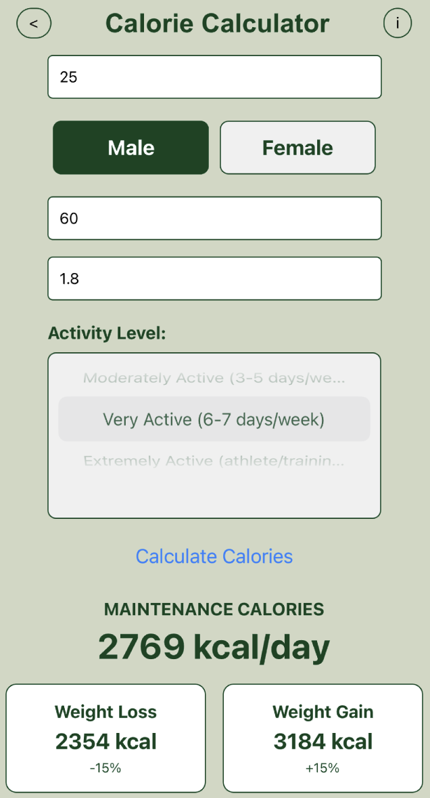

# Fitness-Related-Calculators

## Overview

this project acted as my first solo React Native app and consists of 4 main features:

<ul>
  <li>Calorie calculator</li>
  <li>Macronutrient calculator</li>
  <li>Body fat calculator</li>
  <li>BMI calculator</li>
</ul>
Below I will expand on how each one works

### Calorie calculator

This calculator takes the user's age, gender, height and weight to calculate their Basal Metabolic Rate (BMR), then gives the user options to either gain or lose weight at certain rates by increasing or decreasing their caloric intake respectively

As shown above it allows the user to enter their:

<ul>
  <li>Age</li>
  <li>Gender</li>
  <li>Weight</li>
  <li>Height</li>
  <li>Activity level</li>
</ul>
Then it uses the [Mifflin-St Jeor equation](https://reference.medscape.com/calculator/846/mifflin-st-jeor-equation) for maximum accuracy
